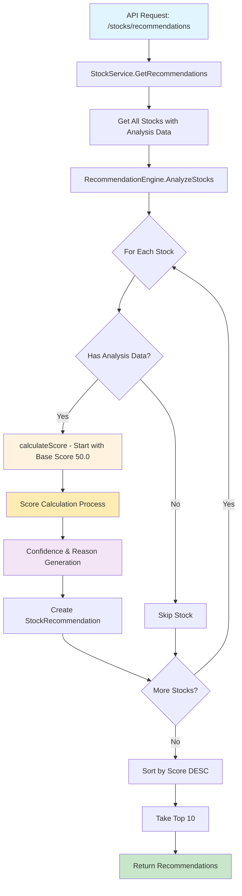
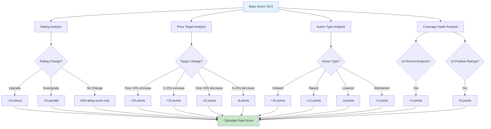
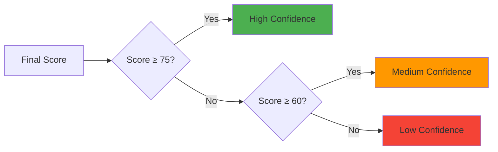
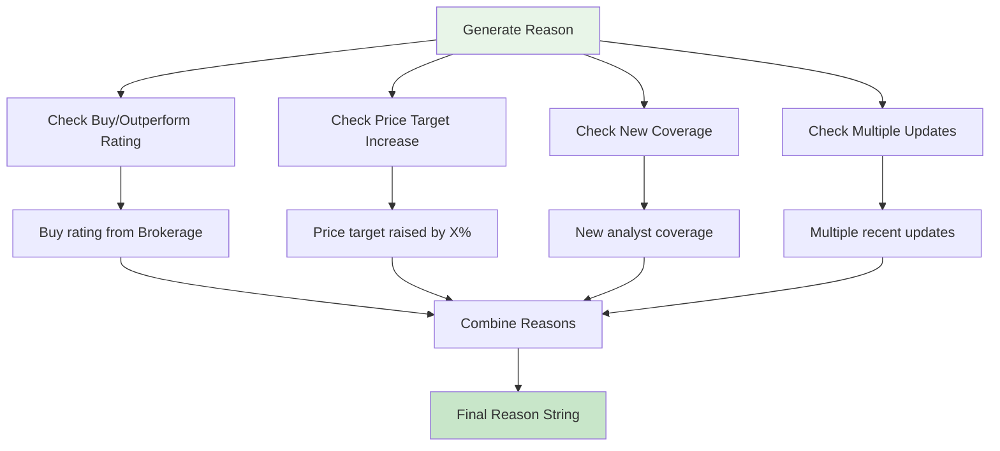
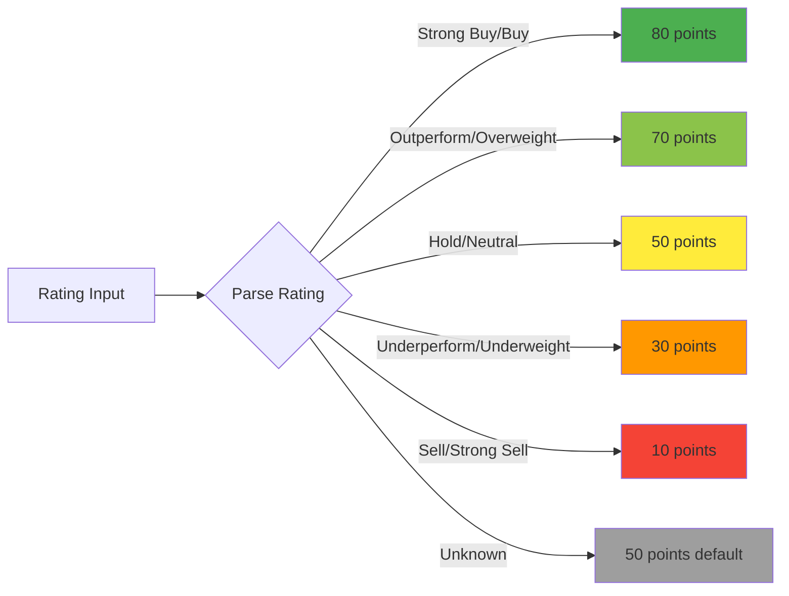

# Stock Recommendation Algorithm Flow

## Main Algorithm Flow

## Score Calculation Detail

## Confidence Assignment

## Reason Generation Process

## Rating Score Mapping

## Algorithm Summary

The recommendation algorithm processes stocks through a multi-factor scoring system:

1. **Base Score**: Every stock starts with 50 points
2. **Rating Analysis**: Adds/subtracts based on analyst ratings and changes
3. **Price Target Analysis**: Rewards target increases, penalizes decreases
4. **Action Analysis**: Considers the type of analyst action taken
5. **Coverage Analysis**: Rewards multiple analyses and positive sentiment
6. **Confidence Assignment**: Categorizes based on final score
7. **Reason Generation**: Creates human-readable explanations
8. **Ranking**: Sorts by score and returns top 10 recommendations

The algorithm emphasizes recent positive analyst actions and upgrades, making it effective for identifying stocks with improving market sentiment.